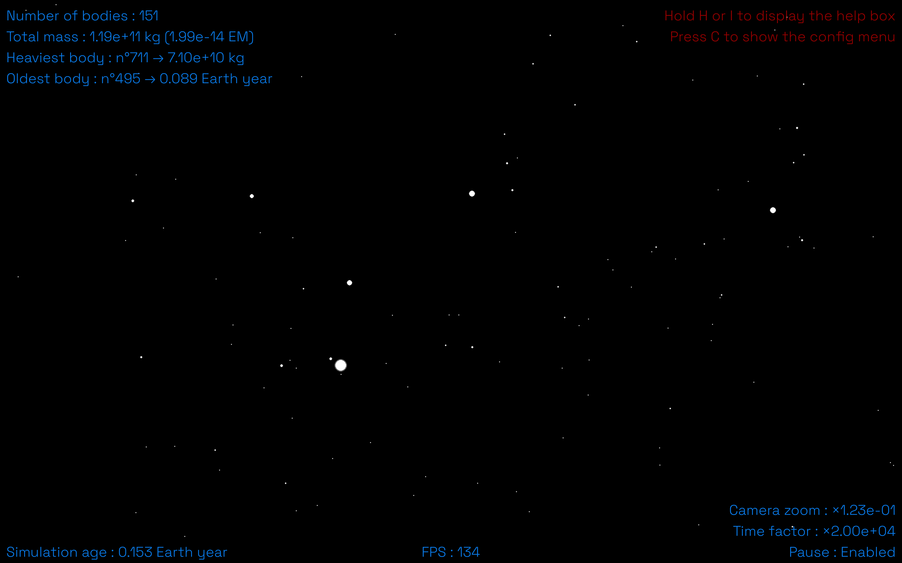
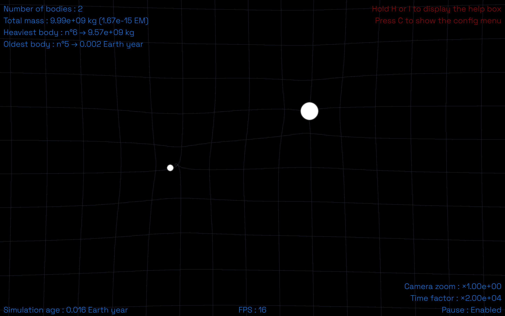
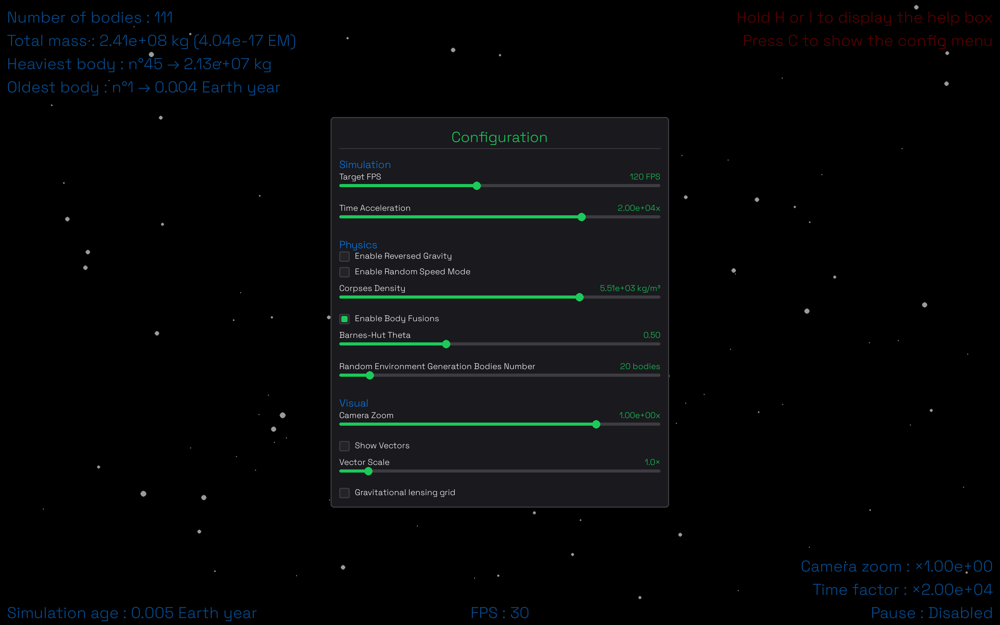
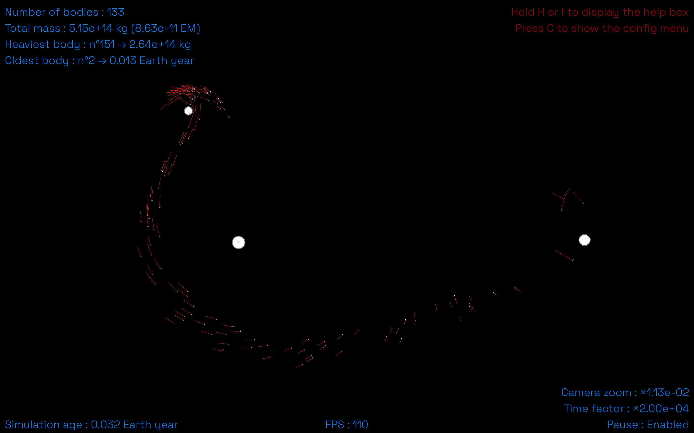
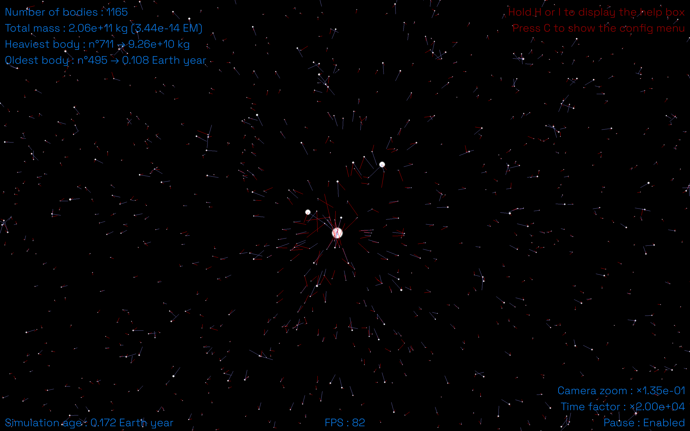

# GravityEngine

*N-body gravitational simulator built with Python and Pygame.*

**v3.9.0** — *Performance & Refactor Edition*

**Author:** Nils DONTOT
**Repository:** [github.com/Nitr0xis/GravityEngine](https://github.com/Nitr0xis/GravityEngine)
**Contact:** nils.dontot.pro@gmail.com

[](https://www.gnu.org/licenses/gpl-3.0)
[](https://www.python.org/downloads/)
[](https://www.pygame.org/)
[](https://github.com/Nitr0xis)

---

I am 15 years old and passionate about space and physics. In mid-2025, I decided to create a gravity simulator with Python. This is the result of my work. Feel free to submit pull requests if you identify potential improvements or optimization opportunities. I am constantly improving it, and I hope you like it.

---

## Table of Contents

- [Overview](#overview)
- [What's New in v3.9](#whats-new-in-v39)
- [Installation](#installation)
- [Building Executables](#building-executables)
- [Controls](#controls)
- [Configuration Panel](#configuration-panel)
- [Physics](#physics)
- [Architecture](#architecture)
- [Educational Use](#educational-use)
- [Troubleshooting](#troubleshooting)
- [Roadmap](#roadmap)
- [Contributing](#contributing)
- [License](#license)

---

## Overview

GravityEngine is an interactive N-body gravitational simulation. Create celestial bodies, watch them orbit, collide, and merge under Newtonian gravity, in real time.

<p align="center"></p>

Key features:

- Pygame configuration panel with real-time parameter adjustment
- Gravitational lensing grid (visual, Newtonian-inspired)
- Fixed timestep physics (1/120s), deterministic simulation
- Full interpolation (position, velocity, force, radius) for smooth rendering
- Zoom-adaptive body generation, complete camera system (pan/zoom/reset)
- Cross-platform file manager (dev + exe)
- Rotating file logger for crash diagnostics
- Adaptive performance mode: 120 FPS with 100+ bodies

---

## What's New in v3.9 — Performance & Refactor Edition

### Force computation: automatic NumPy / Barnes-Hut switching

Two force algorithms are now available and selected automatically at runtime based on body count:

- **NumPy vectorized O(n²)** — faster for small-to-medium simulations (low constant overhead)
- **Barnes-Hut O(n log n)** — faster past a few hundred bodies (theta-based approximation)

The switching threshold is **calibrated automatically at startup** (`physics/calibration.py`): a handful of benchmark runs on synthetic bodies determine which method wins on the current machine, with hysteresis to avoid oscillating near the threshold.

### Collision broad-phase: spatial hash grid

Fusion detection no longer scans all body pairs. A spatial hash grid (`physics/collision_grid.py`) restricts fusion checks to nearby cells, reducing the average case from O(n²) to near O(n).

### Codebase reorganized into packagesn

```
src/
├── run.py                  # entry point
├── core/                   # engine loop, state, logging, utils
├── physics/                # circle, quadtree, collision grid, force dispatch
├── rendering/              # camera, config panel, grid, colors
└── tools/                  # dev-only calibration script
```

### Measured impact

On the reference dev machine: force computation at n=1000 dropped from ~97ms (NumPy alone, previous approach) or ~68ms (Barnes-Hut alone) to whichever is faster automatically — no manual tuning required as the simulation grows or shrinks.

---

## Installation

**Prerequisites:** Python 3.13+, pip

```bash
pip install pygame matplotlib
```

**From source:**

```bash
git clone https://github.com/Nitr0xis/GravityEngine.git
cd GravityEngine
python src/run.py
```

**Pre-built binary (Windows):** download `GravityEngine.exe` from [Releases](https://github.com/Nitr0xis/GravityEngine/releases). No Python required.

**Virtual environment (recommended):**

```bash
python -m venv venv
venv\Scripts\activate      # Windows
source venv/bin/activate   # macOS/Linux
pip install pygame matplotlib
python src/run.py
```

---

## Building Executables

Scripts are in `builders/`:

```bash
builders/build_release.bat   # Production binary
builders/build.bat           # Development binary
builders/clean.bat           # Clean dist/build artifacts
```

Manual PyInstaller command:

```bash
pyinstaller --onefile --windowed --add-data "assets;assets" --name GravityEngine src/run.py
```

Assets are bundled via `--add-data "assets;assets"`. Path resolution uses `sys._MEIPASS` detection at runtime.

---

## Controls

### Camera

| Input | Action |
|---|---|
| Right click + drag | Pan |
| Mouse wheel | Zoom in / out (cursor-centered) |
| `A` / `E` | Zoom in / out (screen-centered) |
| Arrow keys | Pan |
| `T` | Reset camera |

### Bodies

| Input | Action |
|---|---|
| Left click (empty space) | Create body |
| Left click + hold | Grow body exponentially |
| Left click (on body) | Select body |
| `Del` | Delete selected body |

<p align="center"></p>

### Simulation

| Key | Action |
|---|---|
| `Space` | Pause / resume |
| `V` | Toggle velocity / force vectors |
| `B` | Toggle gravitational lensing grid |
| `G` | Toggle reversed gravity (repulsion) |
| `R` | Toggle random velocity mode |
| `P` | Generate 20 random bodies (zoom-adaptive) |
| `S` | Save screenshot |
| `C` | Open / close configuration panel |
| `H` / `I` (hold) | Display help overlay |
| `Escape` | Exit (or close config panel if open) |

---

## Configuration Panel

Press `C` to open. Parameters take effect immediately.

<p align="center"></p>

**Simulation**

| Parameter | Range | Default |
|---|---|---|
| Target FPS | 30–240 | 120 |
| Time Acceleration | 10³–10⁵× | 2×10⁴ |

**Physics**

| Parameter | Type | Default |
|---|---|---|
| Reversed Gravity | toggle | off |
| Random Speed Mode | toggle | off |
| Body Density | 1–10⁵ kg/m³ (log) | 5514 kg/m³ |
| Enable Fusions | toggle | on |

**Visual**

| Parameter | Type | Default |
|---|---|---|
| Camera Zoom | 10⁻⁷–100× (log) | 1× |
| Show Vectors | toggle | off |
| Vector Scale | 0.1–10× | 1× |
| Gravitational Grid | toggle | off |
| Grid Lens Strength | 0–10 | 3.5 |
| Grid Spacing | 40–160 px | 72 px |

**Advanced (Collisions)**

| Parameter | Type | Default |
|---|---|---|
| Adaptive Substeps | toggle | off |
| Substep Precision | +0–8 steps | 0 |

**Persistence:** `Save Config` / `Load Last Config` serialize all parameters to `saves/config.json`. Version mismatch triggers a warning but still applies compatible keys.

---

## Physics

<p align="center"></p>

### Gravitational Force

```
F = G × m₁ × m₂ / r²      G = 6.6743 × 10⁻¹¹ N·m²/kg²
```

### Integration

Fixed timestep (1/120 s), explicit Euler:

```
x(t+dt) = x(t) + v(t) × dt
v(t+dt) = v(t) + (F/m) × dt
```

Physics timestep is decoupled from render FPS. Each render frame consumes as many physics steps as needed from the accumulator (capped at 2 to avoid spiral of death). Interpolation alpha `α = accumulator / timestep` bridges the gap for rendering.

### Interpolated Rendering

```
x_render = x_prev + (x - x_prev) × α
```

Applies to position, velocity, force, radius. Click detection uses interpolated positions, so selection targets what is visually on screen.

### Collision and Fusion

Detection uses overlap of visual (interpolated) radii, confirmed on physical radii. Momentum conservation only:

```
v_merged = (m₁v₁ + m₂v₂) / (m₁ + m₂)
m_merged = m₁ + m₂
r_merged = (3 × m_merged / (4π × density))^(1/3)
```

Kinetic energy is not conserved — perfectly inelastic collision by design.

### Adaptive Substeps

Each base physics step can split into extra substeps based on relative speed and radii (CCD-style, prevents tunnelling). Controlled by `adaptive_substeps_max_extra` (0 = disabled, 8 = up to 9 substeps).

---

## Architecture

## Architecture

Modular structure under `src/`, organized by responsibility. All modules share state via `core/state.py`.

```
src/
├── run.py                    # Entry point: pygame init, engine startup, crash handling
├── core/
│ ├── main.py                 # Main loop, physics dispatch, render orchestration
│ ├── state.py                # Shared globals: engine singleton + circles list
│ ├── action_manager.py       # Input event handlers (mouse, keyboard)
│ ├── atlas.py                # Cross-platform asset and user-data path resolution
│ ├── logger.py               # Rotating file logger
│ ├── utils.py                # Rendering helpers, aggregation
│ └── debugger.py             # Path diagnostics + physics unit tests
├── physics/
│ ├── circle.py               # Body class: physics state, attraction, integration
│ ├── quadtree.py             # Barnes-Hut spatial tree
│ ├── collision_grid.py       # Spatial hash grid for fusion broad-phase
│ ├── forces_manager.py       # NumPy / Barnes-Hut dispatch
│ └── calibration.py          # Automatic method-threshold calibration
├── rendering/
│ ├── camera.py               # World ↔ screen transforms, zoom, pan
│ ├── config_panel.py         # Overlay UI: sliders, checkboxes, buttons, scroll
│ ├── gravitational_grid.py   # Background grid with lensing deformation
│ ├── color.py                # Color class with arithmetic operators + palette
│ └── temp_text.py            # Timed on-screen notifications
└── tools/
└── calibrate_threshold.py    # Dev script: NumPy vs Barnes-Hut benchmarking
```

### Force Computation Strategy

`physics/forces_manager.py` dispatches between two algorithms based on body count, using a threshold calibrated once at startup (`physics/calibration.py`) against the running machine's actual performance:

- **n below threshold:** NumPy vectorized pairwise computation, O(n²) but low per-pair overhead
- **n above threshold:** Barnes-Hut quadtree approximation, O(n log n), theta-controlled accuracy/speed tradeoff

A hysteresis margin around the threshold prevents rapid switching when body count oscillates near the boundary (e.g., during fusion cascades).

### Collision Broad-Phase

`physics/collision_grid.py` partitions bodies into a spatial hash grid sized by the largest body's radius, so fusion checks only scan nearby cells instead of every pair.

### Shared State Pattern

```python
engine: Optional[Engine] = None
circles: list[Circle] = []
```

All modules import `state` and access `state.engine` / `state.circles` directly. Resolves circular imports (`Circle` needs engine settings, `Engine` holds `Circle` references) without dependency injection. `circles` is always mutated in place — reassignment breaks references held elsewhere. Use `state.circles.clear()`, `append()`, `remove()`.

### Coordinate System

`camera.screen_to_world` / `camera.world_to_screen` are the single source of truth for `screen = world × scale + offset`. Physics runs in world space (meters); rendering converts to screen space at draw time.

### File Management

`Atlas` (`atlas.py`) handles dev/exe path differences transparently. Dev mode: user data in `user_data/` inside the project. Exe mode (PyInstaller): user data in `Documents/GravityEngine/`. Assets always resolved via `fm.resource_path()`.

### Logging

`Logger` (`logger.py`) is a static wrapper around `logging.Logger`, initialized once via `Logger.setup(engine.logs_folder_path)`. Rotating file handler, 1 MB per file, 3 backups. Use `Logger.exception()` inside `except` blocks to capture the traceback automatically.

---

## Educational Use

<p align="center"></p>

GravityEngine demonstrates:

- Newton's law of universal gravitation (F = Gm₁m₂/r²)
- Momentum and mass conservation in inelastic collisions
- Fixed timestep integration and determinism
- Render/physics decoupling via linear interpolation
- World-to-screen coordinate transformation
- Gravitational lensing approximation (visual, Newtonian-inspired)
- N-body problem (classical, O(n²) per step, or quadtree method)
- Custom UI design with python using pygame

---

## Troubleshooting

**Config panel not opening:** press `C`, not `Ctrl+C`. Check console/log for import errors.

**Font not found:** verify `assets/fonts/main_font.ttf` exists. Run `Debugger.default_debug()` to print path resolution.

**Simulation too fast / slow:** open config (`C`), adjust Time Acceleration (default 2×10⁴).

**Gravitational grid invisible:** check `grid_lens_amount > 0`. At extreme zoom-out, deformation may be sub-pixel — zoom in or increase lens strength.

**Grid line crossings at high lens strength:** reduce `grid_lens_amount` (cap 10).

**Poor performance with grid enabled:** reduce `grid_max_lines` (default 64) or increase `grid_target_spacing_px`.

**Screenshots not saving:** check `user_data/screenshots/` (dev) or `Documents/GravityEngine/screenshots/` (exe). Verify write permissions.

**Crash with no visible error (exe build):** check `user_data/logs/gravityengine.log` (or `Documents/GravityEngine/logs/` in exe mode) for the traceback.

---

## Roadmap

See [ROADMAP.md](ROADMAP.md) for complete history.

### Recently Completed

| Version | Feature |
|---|---|
| v3.9.0 | Barnes-Hut + NumPy force dispatch, spatial hash collision grid, package reorganization |
| v3.8.0 | Rotating file logger |
| v3.7.0 | Gravitational lensing grid, code modularization |
| v3.5.0 | Configuration panel (Pygame overlay, save/load) |
| v3.3.0 | Interactive help overlay |
| v3.2.0 | Camera system rewrite, zoom-adaptive body generation |

### Current Focus

| Priority | Feature |
|---|---|
| 1 | Save / load simulation scenarios (JSON) |
| 2 | Predefined scenario presets |
| 3 | Performance profiling |
| 4 | CSV data export |

---

## Contributing

See [CONTRIBUTING.md](CONTRIBUTING.md).

Quick version:

1. Fork and clone the repository
2. Create a feature branch: `git checkout -b feature/your-feature`
3. Test: `python src/run.py`
4. Commit: `git commit -m "feat: description"`
5. Open a pull request

Priority areas: save/load system, scenario presets, performance profiling, data export.

---

## License

**GNU General Public License v3.0**

Copyright (c) 2026 Nils DONTOT

Copyleft license: you may use, study, modify, and redistribute this software freely, including commercially. Any distributed modified version must remain licensed under GPL-3.0 and its source code must be made available to recipients.

Preservation of reasonable legal notices or author attributions, as permitted by Section 7(b), is required: if you modify this Program, or any covered work, and distribute a modified version, you must preserve reasonable attribution to the original author (Nils DONTOT) in any "About", credits screen, or README file of the resulting work.

See [LICENSE](LICENSE) — full terms at [gnu.org/licenses/gpl-3.0](https://www.gnu.org/licenses/gpl-3.0).

---

**Repository:** [github.com/Nitr0xis/GravityEngine](https://github.com/Nitr0xis/GravityEngine)
**Issues:** [github.com/Nitr0xis/GravityEngine/issues](https://github.com/Nitr0xis/GravityEngine/issues)

Made with ❤ by Nils DONTOT.

*Last updated: August 2026 — v3.9.0*
